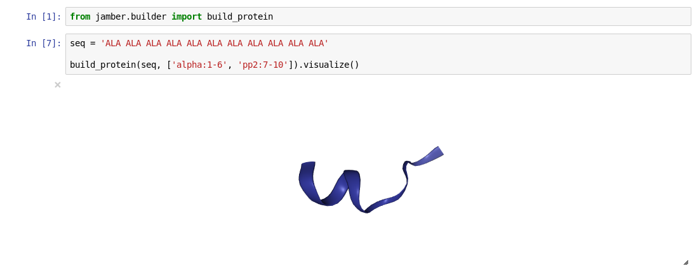

[](https://travis-ci.org/hainm/jamber)

Wrapping some of AmberTools's programs for Jupyter notebook. Please do not use this for your production.

# Install
```bash
git clone https://github.com/hainm/jamber
cd jamber
python setup.py install
# If using ambertools
# amber.python setup.py install
```
# Require
- AmberTools >= 16
- nglview (optional): For visualization in Jupyter notebook

# Example
- [notebooks](./examples)

- leap
```python
    from jamber import leap
    command = """
    source leaprc.protein.ff14SB
    seq = sequence {ALA ALA ALA}
    saveamberparm seq seq.prmtop seq.rst7
    """
    leap.run(command)
```

- builder
```python
from jamber.builder import build_bdna
build_bdna(seq='AAAAAA')
```

- build protein with given secondary structure


